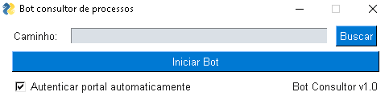
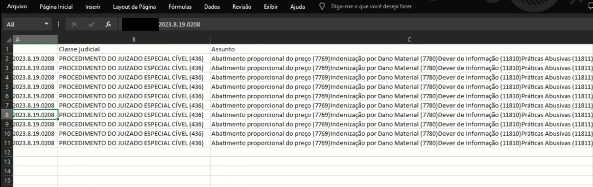

# Consultor PJE ⚖

Olá, eu sou Pedro, e este é mais um dos meus projetos pessoais onde compartilho soluções práticas para desafios do dia a dia. Ao navegar pela vasta rede, é possível encontrar inúmeros projetos interessantes, mas muitos deles carecem de aplicabilidade prática em situações reais.

A proposta deste repositório é oferecer soluções para problemas que surgiram no meu cotidiano e que foram resolvidos por meio deste código. Cada projeto reflete uma experiência pessoal e uma abordagem prática para resolver desafios específicos.

## 🚀 Começando

Em vez de simplesmente buscar projetos por sua complexidade ou inovação, concentro-me em questões reais que encontrei no meu caminho. Acredito que soluções simples e eficazes são valiosas e podem beneficiar outros desenvolvedores e entusiastas.

Conto um pouco mais sobre a ideia para o desenvolvimento desse projeto no meu LinkedIn, mas basicamente transformei uma tarefa de dez dias, exigindo vários operadores, em um processo automatizado livre de operadores e que precisava apenas de 3 horas com esse projeto. 

Basicamente acontece um "input" de números de processo e um "output" das informações dele em uma planilha. 

### 📋 Pré-requisitos

É interessante que você tenha uma IDE para fazer alterações no código Python. O código utiliza as bibliotecas Pysimplegui, Selenium e Openpyxl você pode instalar via CLI. É necessário que você possua ou tenha acesso a um certificado digital de advogado instalado em sua máquina, contudo o código está aberto a modificações que podem tornar possivel acessar com login e senha.

```
pip install pysimplegui
pip install selenium
pip install webdriver-manager
pip install openpyxl
```

### 🔧 Instalação

Essas instruções permitirão que você obtenha uma cópia do projeto em operação na sua máquina local para fins de desenvolvimento e teste.

Este repositório foi projetado com simplicidade em mente. Seguir estes passos simples permitirá que você aproveite as soluções apresentadas:

   1. **Baixe o Script**

 - No diretório principal do projeto, você encontrará o script necessário para a organização dos arquivos. Faça o download do script para o seu ambiente local.

   2. **Instale as Dependências:**

 - Antes de executar o script, certifique-se de instalar todas as dependências necessárias e os módulos autorais "etl.py" e "bot.py". Você pode fazer isso executando o seguinte comando no terminal:

```
pip freeze install requirements.txt
```

   3. **Execute o Script:**

 - Com as dependências instaladas, agora você pode executar o script. Utilize a interface para apontar para o caminho para sua planilha que contém os seus números de processo e a forma de login.




   4. **Interaja com a Interface:**

 - O script iniciará uma interface simples que permitirá que você utilize o bot.
 


### 🔩 Analise os testes de ponta a ponta

Se seguiu todos os passos corretamente é provável que agora você tenha uma planilha com os dados do seu processo.



## 🛠️ Construído com

Nesse projeto usei a IDE da Microsoft, o Visual Studio Code com o compilador Python e as bibliotecas pysimplegui, selenium e openpyxl.

* [Pysimplegui](https://www.pysimplegui.com/) - Biblioteca usada
* [Openpyxl](https://openpyxl.readthedocs.io/en/stable/) - Biblioteca usada
* [Selenium](https://www.selenium.dev/) - Biblioteca usada
* [Visual Studio Code](https://code.visualstudio.com/) - IDE
* [Compilador Python](https://www.python.org/downloads/) - Python

## 🖇️ Colaborando

Projeto autoral feito por mim para atender a minha necessidade. Sinta-se a vontade para colaborar com o projeto para levar a um novo nível!

## 📌 Versão

O projeto está na sua primeira versão.

## ✒️ Autores

Participaram do projeto

* **desenvolvedor** - *Trabalho Inicial* - [Pedro Souza](https://www.linkedin.com/in/pedrosouza-finan/)

## 📄 Licença

Este projeto está sob a licença MIT.

## 🎁 Expressões de gratidão

Agradeço a você que se dispôs a ler e convido a todos para utilizar e colaborar com o projeto visando melhorar cada vez mais.

---